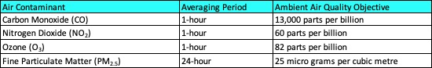

Air Pollution is an urgent problem linked to as many as nine million deaths per year worldwide and 14,000 annually in Canada, primarily from related heart and lung diseases. In Vancouver, British Columbia (BC), sources of air pollution include industrial emissions, vehicle emissions and wildfire smoke. 
The air pollutants of concern include Particulate Matter less than 2.5 µm in size (PM~2.5~), Ozone, Carbon Monoxide (CO), Carbon Dioxide (CO~2~) and Nitrogen Oxides^1^. Breathing high concentrations of these pollutants can cause chronic illnesses, headaches, and even lung cancer and heart disease. 

On UBC campus, sources of air pollution include personal vehicles, construction, restaurants, and businesses. In fact, the BC Air Quality Health Index can change from “Low-Risk” to “High-Risk” on campus during air pollution events such as wildfires.

To address this, we have installed a network of 8 low-cost air quality sensors across UBC campus to measure air pollutant concentrations at different locations on campus. We are leveraging UBC’s existing 5G test bed that includes 1. anonymized video cameras (partnership with Numina^2^ and Blue City^3^) at traffic intersections to track vehicles, buses, pedestrians, and bicyclists; 2. Anonymized mobile data aggregation (partnership with Rogers Communication and Downtown.AI^4^) and 3. Survey Information (partnership with Hello Lamp Post^5^). 

Our low-cost air quality sensors are called “Remote Air Quality Monitoring Platform” (RAMPs). RAMPs are capable of measuring air pollutants such as PM~2.5~, CO, CO~2~, NO and NO~2~ every 15 seconds. RAMPs are solar-powered, battery-operated and can also measure wind speed and direction (with attachments).

# Watch a video to learn more about our air pollution monitoring network on UBC campus

{width="560" height="315"}

# Real-time air quality on UBC campus

Click on this map below to find out more about your personal air pollution exposure at different locations on campus. Click on the individual sensors to read the respective pollutant concentrations across campus. The colour of the circle changes as the PM~2.5~ concentration increases. Breathing high concentrations of PM~2.5~ can lead to chronic illnesses including lung cancer and increased risk of heart attacks.


```{r Scrape_RAMP_data, include=FALSE}

# Install packages not yet installed and load packages

install.packages("caret")
library(caret)

install.packages("randomForest")
library(randomForest)

install.packages("gtools")
library(gtools)

install.packages("rmarkdown")
library(rmarkdown)

install.packages("plyr")
library(plyr)

install.packages("dplyr")
library(dplyr)

install.packages("lubridate")
library(lubridate)

install.packages("leaflet")
library(leaflet)

install.packages("RColorBrewer")
library(RColorBrewer)

install.packages("readr")
library(readr)

install.packages("purrr")
library(purrr)


# Scrape Air Quality Data from internet
# requires 1 input : 
# a) sensorID

# Output: Most recent measurement uploaded by sensors to cloud
# Wont display output in HTML

Scrape_RAMP_Data <- function(sensorID) {

#Loading all the required libraries

# prefix or base URL (which is common for every RAMP Sensor)
baseURL <- 'http://18.222.146.48/RAMP/v1/raw'

# Suffix URL (which is unique for every RAMP Sensor). 
suffixURL <- sensorID
suffixURL <- as.numeric(suffixURL)

#Fetch the URL after combining the base and suffix URL
url2fetch <- paste(baseURL, suffixURL, sep='/')
url2fetch <- paste(url2fetch, "data", sep='/')

#Now, read everything that's in this URL. 
#readLines function is reading the URL so it will contain HTML code 
#such as </td etc etc 
ireach_home <- readLines(url2fetch)

# Now we want to extract all the filenames from the URL and get rid of the HTML tags
#Recognize a Pattern in iReach_home HTML code
mypattern <- '.txt\">([^<]*)</a>' 

#Identify the Line Number (ID) where all of these patterns exist
datalines <- grep(mypattern,ireach_home,value=TRUE)

#Get each expression from each line using the line number and store the matches in a data frame
getexpr = function(s,g)substring(s,g,g+attr(g,'match.length')-1)
gg = gregexpr(mypattern,datalines)
matches = mapply(getexpr,datalines,gg)

#Filenames is a vector of x rows and 1 column. 1st row currently reads '2020-03-07-1005.txt' 
Filenames = gsub(mypattern,'\\1',matches)
names(Filenames) = NULL

# Now that we have the file names, we can define the Filepath of the file on the web.
# 1st row currently reads
#'http://18.222.146.48/RAMP/v1/raw/1005/2020-03-07-1005.txt'
Filepaths <- paste(url2fetch, Filenames, sep='/')

# Choose only the last row
Filepaths <- tail(Filepaths, n =1)

#Now let's extract all the data from the filepath
dat = ldply(Filepaths, read.table, sep = ",", fill = TRUE, header = FALSE)

# Choose the last 15 minutes (n=60, 4 measurements per minute)
dat <- tail(dat, n =60)


# Organize the RAMP data to retain relevant columns, and make
# sure first column is named 'date'
dat <- dat %>% select(V2, V4, V6, V8, V10, V12, V14, V16, V18, V20, V22)
new_names = c("date", "CO_RAMP", "NO_RAMP", "NO2_RAMP", "O3_RAMP",
              "CO2_RAMP", "T_RAMP", "RH_RAMP", "PM1_RAMP", "PM_RAMP", "PM10_RAMP")
names(dat) = new_names
dat$date <- as.POSIXct(strptime(dat$date, format = "%m/%d/%y %H:%M:%S", tz = "Etc/GMT-8"))
#Remove NAs
dat <- dat %>% na.omit()

# Average the reading out
dat <- dat %>% summarise_all(mean)

return(dat)

}

# Naomi's suggestion: make this easier for changing RAMP #s and locations. This can be imported from an external file.
RAMP_info <- read_csv("RAMP_info.csv")

# Scrape data
RAMP_IDs <- as.character(RAMP_info %>% pull(RAMP_IDs))
current_conc <- map_df(RAMP_IDs,Scrape_RAMP_Data)
current_conc <- current_conc %>% mutate(RAMP_IDs = as.numeric(RAMP_IDs))
current_conc <- current_conc %>% mutate(DP_RAMP = 243.12*(log(RH_RAMP/100)+(17.62*T_RAMP)/(243.12+T_RAMP))/(17.62-(log(RH_RAMP/100)+(17.62*T_RAMP)/(243.12+T_RAMP))))
current_conc_PM <- current_conc %>%
  select(PM_RAMP,T_RAMP,RH_RAMP,DP_RAMP)
current_conc_matrix <- data.matrix(current_conc)
current_conc_PM <- data.matrix(current_conc_PM)

base::load(file="./Calibration_Models/CO_model.Rda")
base::load(file="./Calibration_Models/NO_model.Rda")
base::load(file="./Calibration_Models/NO2_model.Rda")
base::load(file="./Calibration_Models/O3_model.Rda")
base::load(file="./Calibration_Models/CO2_model.Rda")
base::load(file="./Calibration_Models/PM_model.Rda")

source(file="./Calibration_Models/CAPS_PR_Apply.R")
source(file="./Calibration_Models/CAPS_RF_Apply.R")
source(file="./Calibration_Models/CAPS_Hybrid_Apply.R")

CO_fit <- round(as.vector(CAPS_Hybrid_Apply(CO_model,current_conc_matrix)),0)
NO_fit <- round(as.vector(CAPS_Hybrid_Apply(NO_model,current_conc_matrix)),0)
NO2_fit <- round(as.vector(CAPS_Hybrid_Apply(NO2_model,current_conc_matrix)),0)
O3_fit <- round(as.vector(CAPS_Hybrid_Apply(O3_model,current_conc_matrix)),0)
CO2_fit <- round(as.vector(CAPS_Hybrid_Apply(CO2_model,current_conc_matrix)),0)
PM_fit <- round(as.vector(CAPS_PR_Apply(PM_model,current_conc_PM)),1)

current_conc_fit <- data.frame(CO_fit,NO_fit,NO2_fit,O3_fit,CO2_fit,PM_fit)
current_conc_fit <- current_conc_fit %>% mutate(RAMP_IDs = as.numeric(RAMP_IDs))
current_conc_all <- inner_join(current_conc,current_conc_fit,by="RAMP_IDs")
current_conc_all <- current_conc_all %>% mutate_at(7:8, round, 1)
```


```{r Pollution_Map, echo=FALSE, message=FALSE}
AQ_df <- inner_join(current_conc_all,RAMP_info)

AQ_df$severity = cut(AQ_df$PM_fit,
                             breaks=c(0,5,10,25,100,1000), right=FALSE,
                             labels=c("<5","5-10","10-25","25-100","100+"))

palette_rev <- rev(brewer.pal(5, "RdYlGn"))
pal <- colorFactor(
  palette = palette_rev,
  domain = AQ_df$severity
)

test_map <- leaflet(width="100%") %>%
  setView(lng=-123.2504, lat= 49.2652, zoom=15) %>%
  addProviderTiles("Esri.WorldStreetMap")


test_map %>%
  addCircles(
    data=AQ_df,
    lng = ~Longitude,
    lat = ~Latitude,
    radius = 30,
    color = 'black',
    fillColor = ~pal(severity),
    fillOpacity = 1,
    weight=1,
    popup = paste0("<strong>ID: </strong>", AQ_df$RAMP_label, "</br>",
                   "<strong>Location: </strong>", AQ_df$RAMP_desc, "</br>",
                   "<strong>PM2.5 (ug/m3): </strong>", AQ_df$PM_fit, "</br>",
                   "<strong>CO (ppb): </strong>", AQ_df$CO_fit, "</br>",
                   "<strong>NO (ppb): </strong>", AQ_df$NO_fit, "</br>",
                   "<strong>NO2 (ppb): </strong>", AQ_df$NO2_fit, "</br>",
                   "<strong>O3 (ppb): </strong>", AQ_df$O3_fit, "</br>",
                   "<strong>CO2 (ppm): </strong>", AQ_df$CO2_fit, "</br>",
                   "<strong>Temperature (C): </strong>", AQ_df$T_RAMP, "</br>",
                   "<strong>Relative Humidity (%): </strong>", AQ_df$RH_RAMP, "</br>",
                   "<strong>Date: </strong>", AQ_df$date)

  ) %>%
  addLegend(
    position = c("topright"),
    pal=pal,
    values=AQ_df$severity,
    title="<strong>PM2.5 (ug/m3)</strong>")
```
# Making sense of air quality data
Metro Vancouver set a maximum allowable exposure level of 25 ug/m3 over a 24-hour period as part of its Air Quality Objectives (as of January 2020). Other air quality objectives are provided in Table 1. 



# Join our efforts
Please spread the word and ask your friends to answer the survey questions by texting 604-409-4498 to engage in friendly banter while learning about air pollution on UBC campus.

# Meet the Researchers (helloairquality@mech.ubc.ca)
1. Surya Dhulipala
2. James Hindson
3. Naomi Zimmerman

# References 
1.	Environment Canada, 2011, Criteria Air Contaminants and Related Pollutants, https://www.ec.gc.ca/Air/default.asp?lang=En&n=7C43740B-1 (accessed August 5, 2021).
2.	https://numina.co/
3.	https://bluecity.ai/
4.	https://www.downtown.ai/
5.	https://hellolamppost.co.uk/
